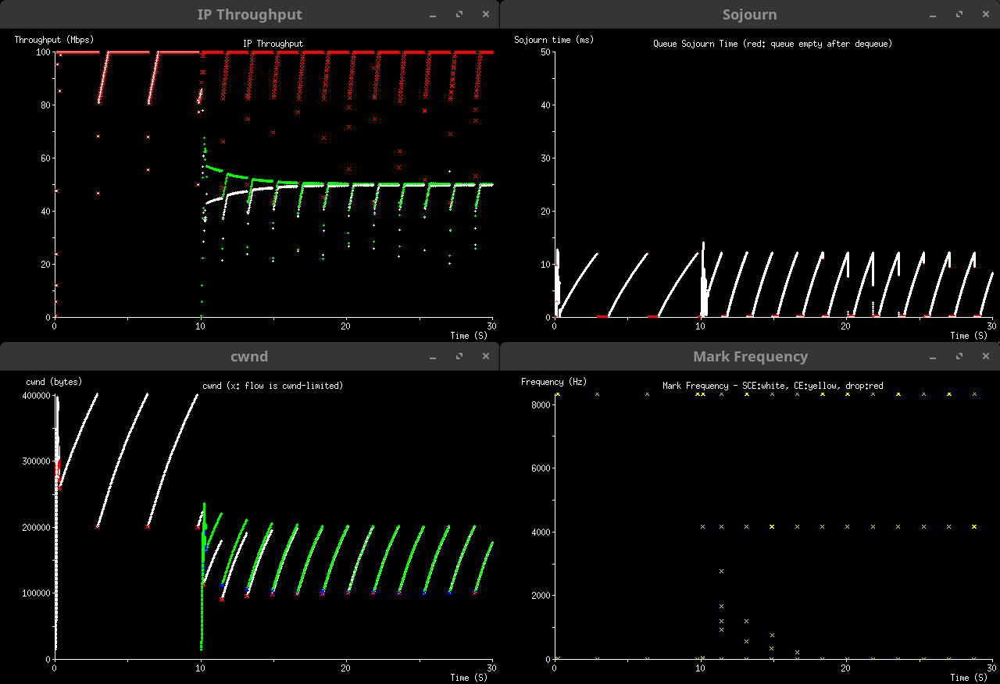
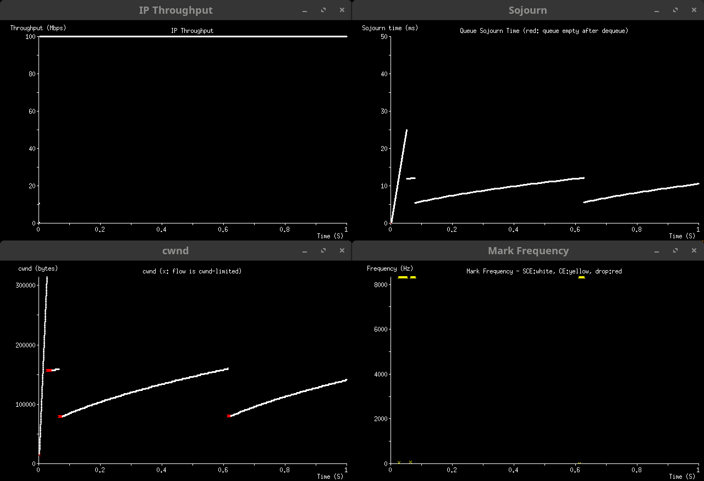
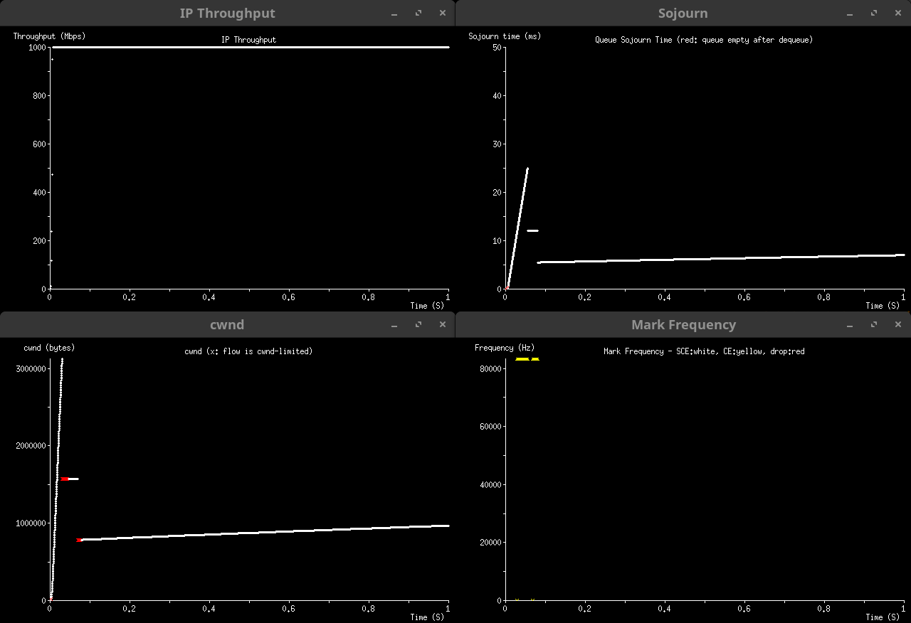
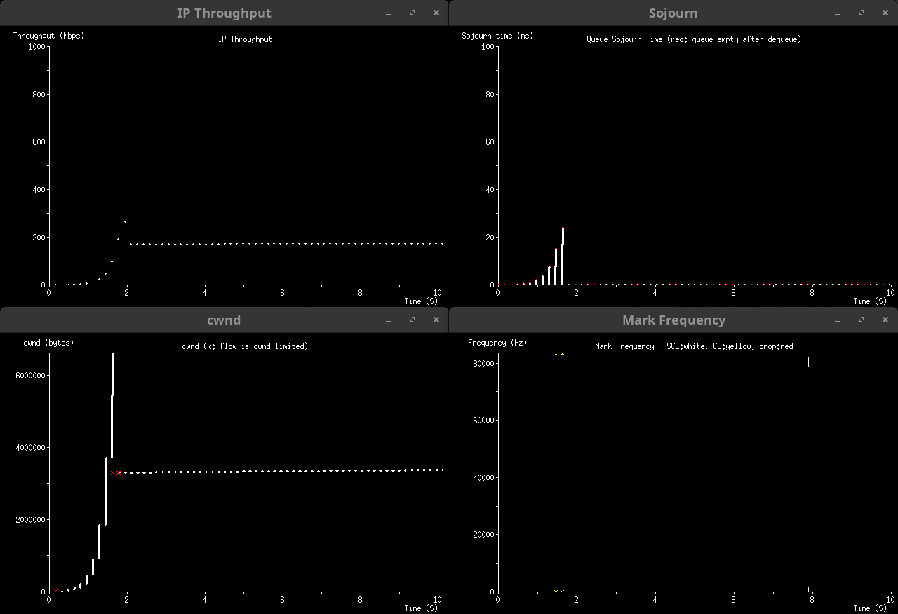

# Extended Slow Start with Pacing (ESSP)

*Jonathan Morton* 
*August 2024*

## Introduction

The traditional slow-start algorithm begins with the congestion window (cwnd)
set to a small Initial Window (say 4 or 10 segments), and adds one segment to
cwnd for each segment newly acknowledged by the receiver, until the first
indication of congestion is recognised.  The growth rate during slow-start is
thus a doubling of the cwnd in each round-trip, and cwnd reaches the
bandwidth-delay product (BDP) in O(log BDP) round-trips.  Thereafter, the
connection operates in congestion-avoidance mode, in which the growth rate is
much less aggressive.

This simple scheme was sufficient for the needs of the late 1980s, in which the
overriding concern was to prevent congestion-collapse events, and network
capacity was generally quite low.  In the 21st century, more sophisticated
approaches such as HyStart and
[HyStart++](https://datatracker.ietf.org/doc/rfc9406/) have emerged, in
conjunction with congestion-avoidance algorithms that scale better to today's
Long Fast Networks (LFNs), characterised by much larger BDPs than in the 1980s,
and large queue buffers occasioned by vastly cheaper memory devices.

HyStart++ is of particular interest, as it not only adds an element of delay
sensitivity to slow-start (reducing delay excursions and burst losses when
encountering a large buffer on the path) as in the original HyStart, but also
employs a two-stage growth pattern to mitigate circumstances where this delay
sensitivity triggers well before the true BDP has been reached.  This phenomenon
arises because the send rate in slow-start arising from ack-clocking is
naturally twice the delivery rate through the path bottleneck to the receiver.
The second stage employs a slower but still exponential growth rate, in which
the send rate is not magnified to the same degree compared to the delivery rate.

When pacing of TCP packets is employed, early exit from slow-start is not
triggered by this phenomenon, but rather a late exit may occur because the
congestion signal is only emitted when the true BDP was reached, and it takes a
full round-trip to find its way back to the sender - by which time the cwnd is
twice as large as it needs to be.  This is partly mitigated if the pacing rate
is *scaled up* to double the theoretical rate - so the inducement of queuing is
advanced by one round-trip - but the results are still not entirely satisfactory
and can result in large delay excursions, even where AQM is in use.  One key
advantage of pacing is that resumption of traffic after an application-limited
idle period does not cause a line-rate burst consisting of the entire congestion
window.

ESSP takes maximum advantage of these basic phenomena, and employs a multi-stage
slow-start with delay sensitivity and careful compensation of both cwnd and
pacing rate to rapidly converge on the correct cwnd, without inducing
excessively large delay excursions.  ESSP can also be used without pacing, but
may take longer to converge in this case.

## Growth Rate & Pacing Rate Sequence

In each growth stage, evolution of cwnd is governed by a factor `K`.  One
segment is added to cwnd for every `K` segments newly acknowledged by the
receiver.

In general, `K` increases in a nearly geometric sequence.  Specifically, we
recommend the Leonardo sequence, where `L(1) = 1`, `L(2) = 3`, `L(n+1) = 1 +
L(n) + L(n-1)`.  This is closely related to the Fibonacci sequence.  The
Leonardo sequence is not the only possible option, but it has some convenient
properties and has been found to work well.  There are, as it happens, 42 unique
Leonardo numbers below 2^30.

In each growth stage, the pacing rate (in bytes per second) is governed by the
formula `S * MSS * cwnd / sRTT`.

The scaling factor `S` is derived from the sequence for `K`, and in the first
stage should be the limit of the product over `1+1/K` for all `K`.  Where the
Leonardo sequence is used for `K`, this limit is fractionally below 4.2, and in
practice the initial value of `S` may be rounded up to 4.2 if convenient for
implementation.  Before advancing to the next `K`, `S` should be updated by
dividing it by `1+1/K`.  A precomputed table of `K` and `S` values may be
useful.

The effect of this sequence of `S` values is to magnify the send rate to the
point where congestion signals will be generated late enough to avoid too early
an exit, but early enough that an excessively large delay excursion can be
avoided.  If pacing is not used, S will effectively be infinite for all stages,
and ESSP will advance to the next stage of (slower) growth significantly earlier
than it would with pacing - which will cause it to take longer to converge to
the true BDP.

## Stage Advancement

Any of the following congestion signals will cause ESSP to advance to the next
growth stage:

- Packet loss
- [CE](https://datatracker.ietf.org/doc/rfc3168/) mark
- [SCE](https://datatracker.ietf.org/doc/draft-morton-tsvwg-sce/) mark
- Instantaneous `iRTT` exceeding `1.25 * minRTT`

The significance of triggering on a 25% increase in delay, rather than some
other value, is that this typically results in the value of `cwnd` being close
to the true BDP at the moment the measured delay reaches this value.  Thus,
after the response below, there is a relatively short distance between the
adjusted value and the desired final outcome, minimising the time necessary to
converge on the solution.

For example, suppose we have `minRTT = 84ms` and we are in the first stage with
`K = 1`.  Due to the initial value of S, each burst of traffic will be sent in
20ms, 84ms apart, and the amount of traffic in each subsequent burst will
double.  We can consider two extreme cases: when the measured delay just reaches
the 25% trigger point (ie. 105ms) at the end of a burst; and when the trigger is
just missed in one burst, occurring midway through the next instead.

In the first case, we know that it took 21ms longer to deliver the burst through
the bottleneck than it did to transmit it.  That is, the burst was sent over
20ms but delivered over 41ms, and the link was then idle for a further 43ms.
The following burst will be limited by ack-clocking rather than pacing, and will
be sent over 41ms, taking 82ms (almost exactly the baseline RTT) to deliver.
Just as the last ack from the first burst was received, triggering the delay
criterion, the last packet of the second burst was being sent - so that is
committed.  At this moment, `cwnd` corresponds to 82ms' worth of traffic on an
84ms path - a very close match.  The measured delay ratio is 5:4, so the next
stage begins with a `cwnd` corresponding to 65.6ms' worth of traffic, and one
round-trip will (with `K = 3`) increase this to 87.5ms.

In the second case, the burst which took 20ms to send and 41ms to deliver just
barely failed to trigger the delay criterion.  Thus, the next burst which was
sent over 41ms and delivered over 82ms will trigger it one round-trip later.
This will show an induced delay of 41ms, the difference between the time the
last packet entered the queue to when it departed.  But only 21ms of added delay
is needed for the trigger, so this will occur just over midway through the
burst, from a packet dequeued at about the 41ms mark.  This means that, after a
2ms idle period, the *third* burst will begin to be sent, and will transmit
about 82ms' worth of data over a 41ms interval, before ESSP notices the delay
has increased to the trigger point.  At this point `cwnd` will have increased to
the equivalent of 123ms RTT, and the measured delay to compensate is again in a
5:4 ratio, so the revised `cwnd` is 98.4ms, and a further 16ms or so of traffic
will be sent in the present burst.  Since 98.4ms is above the actual RTT,
transmission will now be continuous, but since it is below the delay trigger
point and further growth will be at a slower rate in the next stage, we can see
that the next correction will converge towards the true BDP.

Conversely, if we were to trigger only on a doubling of delay, this would ensure
that the delay criterion only ever triggers when the link has fully saturated,
and the theoretical benefit of the increased pacing rate for early detection of
queuing is lost.  Because the *cwnd targeting* works so well with this
threshold, as described above, we do not apply an artificial "ceiling" to the
delay trigger as HyStart++ does.  We also no not apply an artificial "floor", on
the grounds that this would only apply on very short paths, where an early exit
from slow-start is relatively harmless due to the high performance of ordinary
congestion-avoidance algorithms in this case.

ESSP does not perform the "standard" response to packet loss, CE mark, or SCE
mark as a congestion-avoidance algorithm would.  Instead, after advancing to the
next values of `K` and `S`, the initial cwnd for the next stage is calculated as
`cwnd * minRTT / iRTT`.  This is called *cwnd targeting*, and compensates for
both early (by continuing with the existing cwnd) and late (by cutting out the
cause of a delay excursion) triggering.  It is important that the
*instantaneous* `iRTT` sample is used for this calculation, not the *smoothed*
`sRTT` nor any estimate of the *maximum* RTT.

After advancing to the next growth stage, ESSP suppresses this response to
congestion signals until the first data sent with the new values of cwnd, `K`,
and `S` is acknowledged.  If a congestion response is required by the transport
protocol meanwhile, this is implemented using the *cwnd targeting* formula
without advancing to the next growth stage.

## Exiting Slow Start

ESSP tracks not only the currently operative `K` value, but the value twice as
far down the `K` sequence, denoted `KK`, which for a near-geometric sequence is
approximately the square of `K`.  When `KK` exceeds cwnd (in segments), ESSP
considers that there is little to no value in continuing with slow-start in
preference to congestion-avoidance.

Early prototypes of ESSP continued in slow-start until `K` itself exceeded cwnd,
on the grounds that this was the point where the growth rate of slow-start would
cross that of the Reno linear growth function.  It was noticed that the correct
cwnd was already found using half this number of stages, and that the additional
stages could take a long time to complete, especially in conditions where CUBIC
would grow much faster than Reno.

This transition is marked by forcing `S = 1.0`, performing one final round of
*cwnd targeting* to obtain the final value of `cwnd`, and recalculating the
pacing rate to spread this calculated `cwnd` over a period of `sRTT` (not
`minRTT` or `iRTT`).  The TCP state variable `ssthresh` is set to the final
cwnd, and control is then passed to the appropriate congestion-avoidance
algorithm.

Note that if the path bottleneck is SCE-aware, the slow-start sequence will
usually have triggered some SCE marks.  The presence or absence of SCE marks can
thus be used as a reliable heuristic to choose the initial operating mode for
congestion-avoidance, if relevant.

## Tests

> [!IMPORTANT]
> Please review this introduction before interpreting the test results.

The test scenarios below demonstrate some of the problems with standard slow
start, and how ESSP fixes them.  The tests were done using
[scim](https://github.com/heistp/scim), a discrete event simulator written to
quickly try new ideas.  These simulations may not reflect real world results
exactly, but they illustrate behaviors that do occur in reality in a similar
way.

Unless otherwise noted, all tests were done with a queue that does CE-only
marking at a sojourn time threshold of 12 ms.  This approximates the behavior in
a FIFO queue, but since packets are not dropped at the threshold, sojourn times
are not clamped like they would be in a FIFO.

All flows use the Reno CCA, because the main focus is on slow start behavior.
All standard slow start flows have pacing disabled, and all ESSP flows have
pacing enabled.

### One Flow

*Figure 1a: One flow, 100 Mbps, 20 ms RTT, standard slow start
([log](results/f1a-oneflow-100mbps-20ms-std.txt))*

*Figure 1b: One flow, 100 Mbps, 20 ms RTT, ESSP
([log](results/f1b-oneflow-100mbps-20ms-essp.txt))*

---

*Figure 2a: One flow, 1000 Mbps, 20 ms RTT, standard slow start
([log](results/f2a-oneflow-1000mbps-20ms-std.txt))*

*Figure 2b: One flow, 1000 Mbps, 20 ms RTT, ESSP
([log](results/f2b-oneflow-1000mbps-20ms-essp.txt))*

---

*Figure 3a: One flow, 10000 Mbps, 20 ms RTT, standard slow start
([log](results/f3a-oneflow-10000mbps-20ms-std.txt))*

*Figure 3b: One flow, 10000 Mbps, 20 ms RTT, ESSP
([log](results/f3b-oneflow-10000mbps-20ms-essp.txt))*

### Two Flow

*Figure 4a: Two flow, 100 Mbps, 20 ms RTT, standard slow start
([log](results/f4a-twoflow-100mbps-20ms-std.txt))*

*Figure 4b: Two flow, 100 Mbps, 20 ms RTT, ESSP
([log](results/f4b-twoflow-100mbps-20ms-essp.txt))*

---

*Figure 5a: Two flow, 1000 Mbps, 20 ms RTT, standard slow start
([log](results/f5a-twoflow-1000mbps-20ms-std.txt))*

*Figure 5b: Two flow, 1000 Mbps, 20 ms RTT, ESSP
([log](results/f5b-twoflow-1000mbps-20ms-essp.txt))*

---

*Figure 6a: Two flow, 10000 Mbps, 20 ms RTT, standard slow start
([log](results/f6a-twoflow-10000mbps-20ms-std.txt))*

*Figure 6b: Two flow, 10000 Mbps, 20 ms RTT, ESSP
([log](results/f6a-twoflow-10000mbps-20ms-std.txt))*

### Low RTT

*Figure 7a: One flow, 100 Mbps, 1 ms RTT, standard slow start
([log](results/f7a-oneflow-100mbps-1ms-std.txt))*

*Figure 7b: One flow, 100 Mbps, 1 ms RTT, ESSP
([log](results/f7b-oneflow-100mbps-1ms-essp.txt))*

---

*Figure 8a: One flow, 1000 Mbps, 1 ms RTT, standard slow start
([log](results/f8a-oneflow-1000mbps-1ms-std.txt))*

*Figure 8b: One flow, 1000 Mbps, 1 ms RTT, ESSP
([log](results/f8b-oneflow-1000mbps-1ms-essp.txt))*

### High RTT

*Figure 9a: One flow, 100 Mbps, 160 ms RTT, standard slow start
([log](results/f9a-oneflow-100mbps-160ms-std.txt))*

*Figure 9b: One flow, 100 Mbps, 160 ms RTT, HyStart++
([log](results/f9b-oneflow-100mbps-160ms-hspp.txt))*

*Figure 9c: One flow, 100 Mbps, 160 ms RTT, ESSP
([log](results/f9c-oneflow-100mbps-160ms-essp.txt))*

---

*Figure 10a: One flow, 1000 Mbps, 160 ms RTT, standard slow start
([log](results/f10a-oneflow-1000mbps-160ms-std.txt))*

*Figure 10b: One flow, 1000 Mbps, 160 ms RTT, HyStart++
([log](results/f10b-oneflow-1000mbps-160ms-hspp.txt))*

*Figure 10c: One flow, 1000 Mbps, 160 ms RTT, ESSP
([log](results/f10c-oneflow-1000mbps-160ms-essp.txt))*

### SCE Marking

*Figure 11a: One non-SCE flow, 100 Mbps, 80 ms RTT, ESSP, DelTiC AQM
([log](results/f11a-oneflow-100mbps-80ms-essp.txt))*

*Figure 11b: One SCE flow, 100 Mbps, 80 ms RTT, ESSP, DelTiC AQM
([log](results/f11b-oneflow-100mbps-80ms-essp-sce.txt))*

---

*Figure 12a: One non-SCE flow, 1000 Mbps, 80 ms RTT, ESSP, DelTiC AQM
([log](results/f12a-oneflow-1000mbps-80ms-essp.txt))*

*Figure 12b: One SCE flow, 1000 Mbps, 80 ms RTT, ESSP, DelTiC AQM
([log](results/f12b-oneflow-1000mbps-80ms-essp-sce.txt))*
