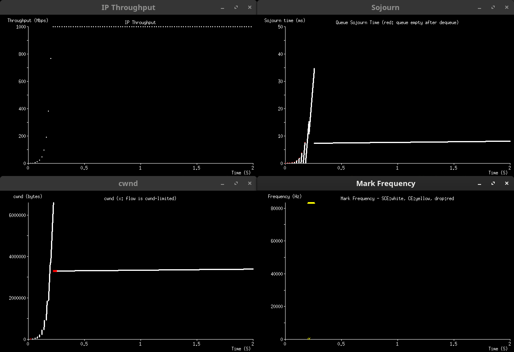
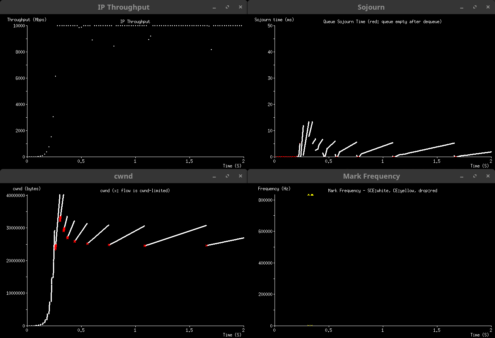
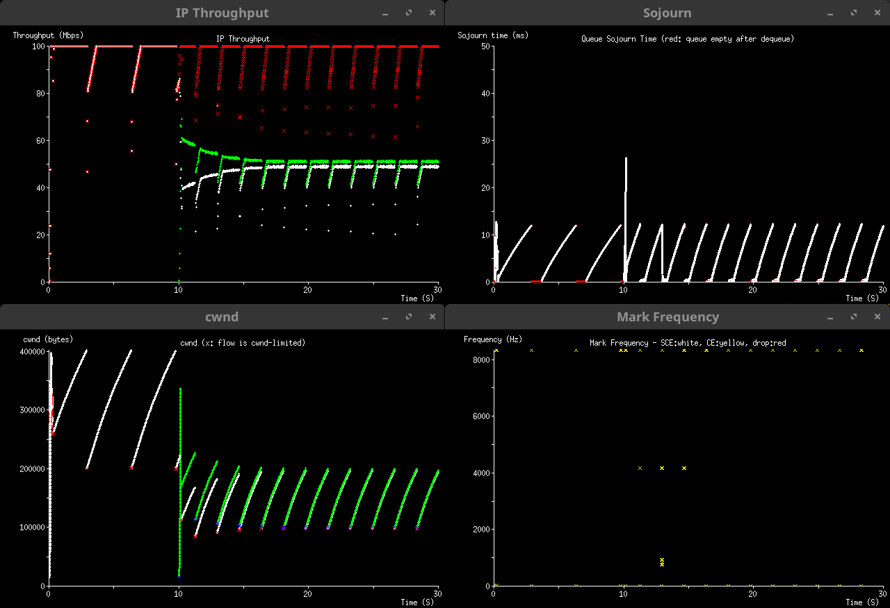
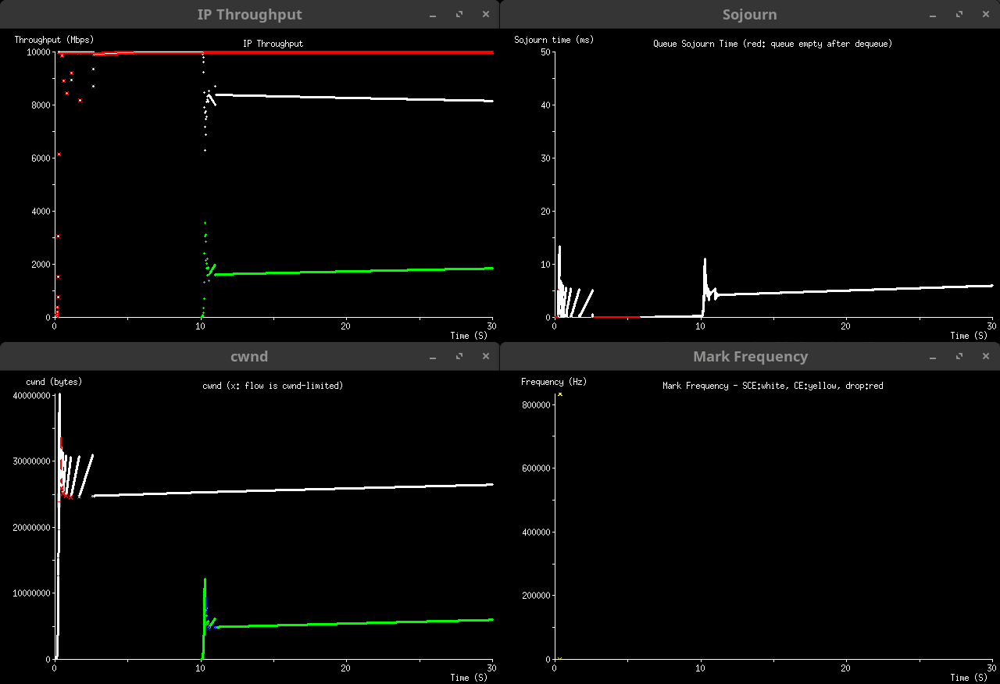
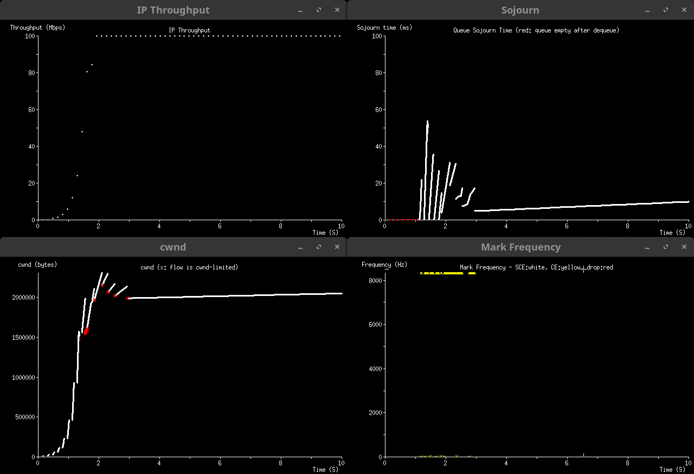
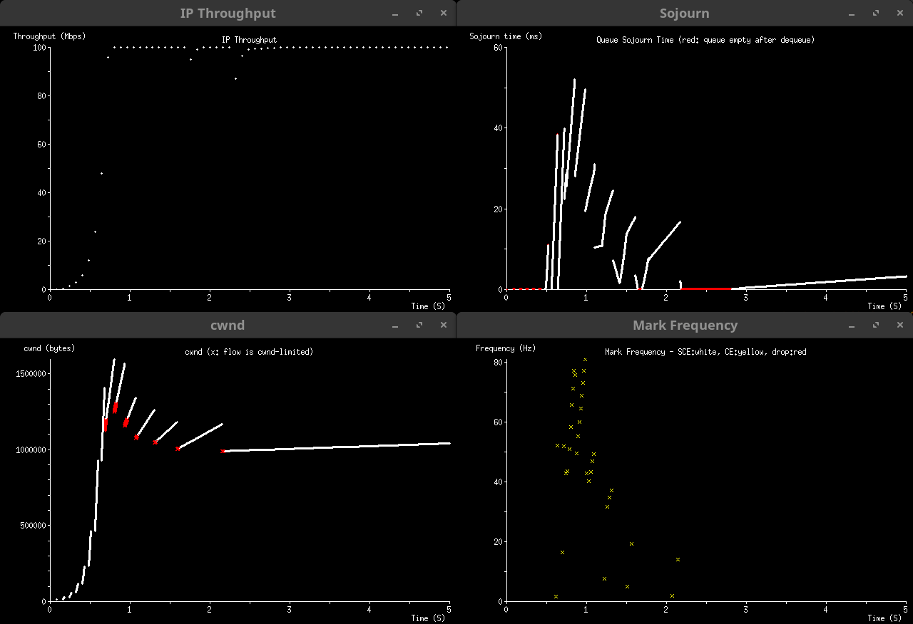
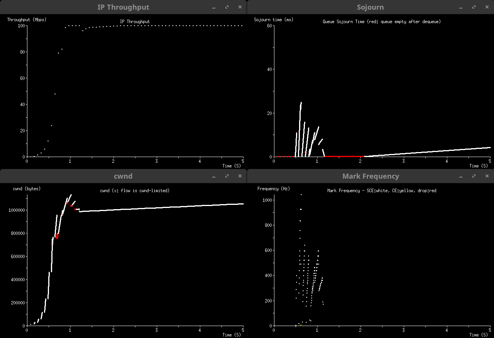

# Extended Slow Start with Pacing (ESSP)

*Jonathan Morton*<br/>
*August 2024, updated July 2025*

## Introduction

The traditional slow-start algorithm begins with the congestion window (cwnd)
set to a small Initial Window (say 4 or 10 segments), and adds one segment to
cwnd for each segment newly acknowledged by the receiver, until the first
indication of congestion is recognised.  The growth rate during slow-start is
thus a doubling of the cwnd in each round-trip, and cwnd reaches the
bandwidth-delay product (BDP) in O(log BDP) round-trips.  Thereafter, the
connection operates in congestion-avoidance mode, in which the growth rate is
much less aggressive.

This simple scheme was sufficient for the needs of the late 1980s, in which the
overriding concern was to prevent congestion-collapse events, and network
capacity was generally quite low.  In the 21st century, more sophisticated
approaches such as HyStart and
[HyStart++](https://datatracker.ietf.org/doc/rfc9406/) have emerged, in
conjunction with congestion-avoidance algorithms that scale better to today's
Long Fast Networks (LFNs), characterised by much larger BDPs than in the 1980s,
and large queue buffers occasioned by vastly cheaper memory devices.

HyStart++ is of particular interest, as it not only adds an element of delay
sensitivity to slow-start (reducing delay excursions and burst losses when
encountering a large buffer on the path) as in the original HyStart, but also
employs a two-stage growth pattern to mitigate circumstances where this delay
sensitivity triggers well before the true BDP has been reached.  This phenomenon
arises because the send rate in slow-start arising from ack-clocking is
naturally twice the delivery rate through the path bottleneck to the receiver.
The second stage employs a slower but still exponential growth rate, in which
the send rate is not magnified to the same degree compared to the delivery rate.

When pacing of TCP packets is employed, early exit from slow-start is not
triggered by this phenomenon, but rather a late exit may occur because the
congestion signal is only emitted when the true BDP was reached, and it takes a
full round-trip to find its way back to the sender - by which time the cwnd is
twice as large as it needs to be.  This is partly mitigated if the pacing rate
is *scaled up* to double the theoretical rate - so the inducement of queuing is
advanced by one round-trip - but the results are still not entirely satisfactory
and can result in large delay excursions, even where AQM is in use.  One key
advantage of pacing is that resumption of traffic after an application-limited
idle period does not cause a line-rate burst consisting of the entire congestion
window.

ESSP takes maximum advantage of these basic phenomena, and employs a multi-stage
slow-start with delay sensitivity and careful compensation of both cwnd and
pacing rate to rapidly converge on the correct cwnd, without inducing
excessively large delay excursions.  ESSP can also be used without pacing, but
may take longer to converge in this case.

## Growth Rate & Pacing Rate Sequence

In each growth stage, evolution of cwnd is governed by a factor `K`.  One
segment is added to cwnd for every `K` segments newly acknowledged by the
receiver.

In general, `K` increases in a nearly geometric sequence.  Specifically, we
recommend the Leonardo sequence, where `L(1) = 1`, `L(2) = 3`, `L(n+1) = 1 +
L(n) + L(n-1)`.  This is closely related to the Fibonacci sequence.  The
Leonardo sequence is not the only possible option, but it has some convenient
properties and has been found to work well.  There are, as it happens, 42 unique
Leonardo numbers below 2^30.

In each growth stage, the pacing rate (in bytes per second) is governed by the
formula `S * MSS * cwnd / sRTT`.

The scaling factor `S` is derived from the sequence for `K`, and in the first
stage should be the limit of the product over `1+1/K` for all `K`.  Where the
Leonardo sequence is used for `K`, this limit is fractionally below 4.2, and in
practice the initial value of `S` may be rounded up to 4.2 if convenient for
implementation.  Before advancing to the next `K`, `S` should be updated by
dividing it by `1+1/K`.  A precomputed table of `K` and `S` values may be
useful.

The effect of this sequence of `S` values is to magnify the send rate to the
point where congestion signals will be generated late enough to avoid too early
an exit, but early enough that an excessively large delay excursion can be
avoided.  If pacing is not used, S will effectively be infinite for all stages,
and ESSP will advance to the next stage of (slower) growth significantly earlier
than it would with pacing - which will cause it to take longer to converge to
the true BDP.

## Stage Advancement

Any of the following congestion signals will cause ESSP to advance to the next
growth stage:

- Packet loss
- [CE](https://datatracker.ietf.org/doc/rfc3168/) mark
- [SCE](https://datatracker.ietf.org/doc/draft-morton-tsvwg-sce/) mark
- Instantaneous `iRTT` exceeding `1.25 * minRTT`

The significance of triggering on a 25% increase in delay, rather than some
other value, is that this typically results in the value of `cwnd` being close
to the true BDP at the moment the measured delay reaches this value.  Thus,
after the response below, there is a relatively short distance between the
adjusted value and the desired final outcome, minimising the time necessary to
converge on the solution.

For example, suppose we have `minRTT = 84ms` and we are in the first stage with
`K = 1`.  Due to the initial value of S, each burst of traffic will be sent in
20ms, 84ms apart, and the amount of traffic in each subsequent burst will
double.  We can consider two extreme cases: when the measured delay just reaches
the 25% trigger point (ie. 105ms) at the end of a burst; and when the trigger is
just missed in one burst, occurring midway through the next instead.

In the first case, we know that it took 21ms longer to deliver the burst through
the bottleneck than it did to transmit it.  That is, the burst was sent over
20ms but delivered over 41ms, and the link was then idle for a further 43ms.
The following burst will be limited by ack-clocking rather than pacing, and will
be sent over 41ms, taking 82ms (almost exactly the baseline RTT) to deliver.
Just as the last ack from the first burst was received, triggering the delay
criterion, the last packet of the second burst was being sent - so that is
committed.  At this moment, `cwnd` corresponds to 82ms' worth of traffic on an
84ms path - a very close match.  The measured delay ratio is 5:4, so the next
stage begins with a `cwnd` corresponding to 65.6ms' worth of traffic, and one
round-trip will (with `K = 3`) increase this to 87.5ms.

In the second case, the burst which took 20ms to send and 41ms to deliver just
barely failed to trigger the delay criterion.  Thus, the next burst which was
sent over 41ms and delivered over 82ms will trigger it one round-trip later.
This will show an induced delay of 41ms, the difference between the time the
last packet entered the queue to when it departed.  But only 21ms of added delay
is needed for the trigger, so this will occur just over midway through the
burst, from a packet dequeued at about the 41ms mark.  This means that, after a
2ms idle period, the *third* burst will begin to be sent, and will transmit
about 82ms' worth of data over a 41ms interval, before ESSP notices the delay
has increased to the trigger point.  At this point `cwnd` will have increased to
the equivalent of 123ms RTT, and the measured delay to compensate is again in a
5:4 ratio, so the revised `cwnd` is 98.4ms, and a further 16ms or so of traffic
will be sent in the present burst.  Since 98.4ms is above the actual RTT,
transmission will now be continuous, but since it is below the delay trigger
point and further growth will be at a slower rate in the next stage, we can see
that the next correction will converge towards the true BDP.

Conversely, if we were to trigger only on a doubling of delay, this would ensure
that the delay criterion only ever triggers when the link has fully saturated,
and the theoretical benefit of the increased pacing rate for early detection of
queuing is lost.  Because the *cwnd targeting* works so well with this
threshold, as described above, we do not apply an artificial "ceiling" to the
delay trigger as HyStart++ does.  We also do not apply an artificial "floor", on
the grounds that this would only apply on very short paths, where an early exit
from slow-start is relatively harmless due to the high performance of ordinary
congestion-avoidance algorithms in this case.

ESSP does not perform the "standard" response to packet loss, CE mark, or SCE
mark as a congestion-avoidance algorithm would.  Instead, after advancing to the
next values of `K` and `S`, the initial cwnd for the next stage is calculated as
`cwnd * minRTT / iRTT`.  This is called *cwnd targeting*, and compensates for
both early (by continuing with the existing cwnd) and late (by cutting out the
cause of a delay excursion) triggering.  It is important that the
*instantaneous* `iRTT` sample is used for this calculation, not the *smoothed*
`sRTT` nor any estimate of the *maximum* RTT.

After advancing to the next growth stage, ESSP suppresses this response to
congestion signals until the first data sent with the new values of cwnd, `K`,
and `S` is acknowledged.  If a congestion response is required by the transport
protocol meanwhile, this is implemented using the *cwnd targeting* formula
without advancing to the next growth stage.

## Exiting Slow Start

ESSP tracks not only the currently operative `K` value, but the value twice as
far down the `K` sequence, denoted `KK`, which for a near-geometric sequence is
approximately the square of `K`.  When `KK` exceeds cwnd (in segments), ESSP
considers that there is little to no value in continuing with slow-start in
preference to congestion-avoidance.

Early prototypes of ESSP continued in slow-start until `K` itself exceeded cwnd,
on the grounds that this was the point where the growth rate of slow-start would
cross that of the Reno linear growth function.  It was noticed that the correct
cwnd was already found using half this number of stages, and that the additional
stages could take a long time to complete, especially in conditions where CUBIC
would grow much faster than Reno.

This transition is marked by forcing `S = 1.0`, performing one final round of
*cwnd targeting* to obtain the final value of `cwnd`, and recalculating the
pacing rate to spread this calculated `cwnd` over a period of `sRTT` (not
`minRTT` or `iRTT`).  The TCP state variable `ssthresh` is set to the final
cwnd, and control is then passed to the appropriate congestion-avoidance
algorithm.

Note that if the path bottleneck is SCE-aware, the slow-start sequence will
usually have triggered some SCE marks.  The presence or absence of SCE marks can
thus be used as a reliable heuristic to choose the initial operating mode for
congestion-avoidance, if relevant.

## Tests

> [!IMPORTANT]
> Please review this introduction before interpreting the test results.

The test scenarios below demonstrate some of the problems with standard slow
start, and how ESSP fixes them.  The tests were done using
[scim](https://github.com/heistp/scim), a discrete event simulator written to
quickly try new ideas.  These simulations may not reflect real world results
exactly, but they illustrate behaviors that do occur in reality in a similar
way.

Unless otherwise noted, all tests were done with a queue that does CE-only
marking at a sojourn time threshold of 12 ms.  This approximates the behavior in
a FIFO queue, but since packets are not dropped at the threshold, sojourn times
are not clamped like they would be in a FIFO.

All flows use the Reno CCA, because the main focus is on slow start (SS)
behavior.  All standard slow start flows have pacing disabled, and all ESSP
flows have pacing enabled.

In addition to the plots, there are links to the log files with each of the
Figure captions.  These show slow start exit times and cwnd, and stage
information for ESSP.

### One Flow at 20 ms RTT

This series of tests compares standard SS vs ESSP at 20 ms RTT, with three
different bandwidths: 100 Mbps (Figure 1a/1b), 1000 Mbps (Figure 2a/2b) and 10
Gbps (Figure 3a/3b).

Comparing Figure 1a (standard) vs Figure 1b (ESSP), we see that standard SS
exits with a cwnd of 375756 bytes (from the log file), and ESSP exits at 258222,
much closer to the BDP of 250000 bytes.  Since standard is too high, it's marked
with CE shortly after SS exit, causing a multiplicative decrease (MD) and loss
in throughput earlier than necessary.

We also see in the ESSP log files for Figures 1b, 2b and 3b that ESSP is able to
perform slow start using only its delay trigger, resulting in smaller sojourn
time excursions in each case than standard SS.

In the 10 Gbps case (Figure 3b), ESSP hasn't quite exited slow start by the end
of the two second test, but we can see that its exit cwnd would already be very
close to the BDP of 25 MB.


*Figure 1a: One flow, 100 Mbps, 20 ms RTT, standard slow start
([log](results/f1a-oneflow-100mbps-20ms-std.txt))*


*Figure 1b: One flow, 100 Mbps, 20 ms RTT, ESSP
([log](results/f1b-oneflow-100mbps-20ms-essp.txt))*

---


*Figure 2a: One flow, 1000 Mbps, 20 ms RTT, standard slow start
([log](results/f2a-oneflow-1000mbps-20ms-std.txt))*


*Figure 2b: One flow, 1000 Mbps, 20 ms RTT, ESSP
([log](results/f2b-oneflow-1000mbps-20ms-essp.txt))*

---


*Figure 3a: One flow, 10000 Mbps, 20 ms RTT, standard slow start
([log](results/f3a-oneflow-10000mbps-20ms-std.txt))*


*Figure 3b: One flow, 10000 Mbps, 20 ms RTT, ESSP
([log](results/f3b-oneflow-10000mbps-20ms-essp.txt))*

### Two Flows at 20 ms RTT

This series of tests **always** starts with an ESSP flow (so it reliably reaches
BDP), then introduces a second flow at T=10 seconds using either standard SS or
ESSP.  Figures 1a&1b are at 100 Mbps, Figures 2a&2b are at 1000 Mbps and Figures
3a&3b are at 10 Gbps.

In each of the results, ESSP induces less queueing delay when the second flow is
introduced than standard SS, due to its delay trigger.

We see that while the exit cwnd for ESSP in the 100 Mbps and 1000 Mbps cases is
close to half the capacity, it's lower in the 10 Gbps case.  It's not a goal of
ESSP for new flows to exit SS at their fair share, but to make good use of the
available capacity.  We also note that Reno-linear growth is slow and not well
suited to 10 Gbps at 20 ms RTT, so convergence times are long.  Either CUBIC or
a scalable congestion control algorithm (CCA) would be better suited to these
conditions.


*Figure 4a: Two flow, 100 Mbps, 20 ms RTT, ESSP then standard slow start
([log](results/f4a-twoflow-100mbps-20ms-std.txt))*


*Figure 4b: Two flow, 100 Mbps, 20 ms RTT, ESSP then ESSP
([log](results/f4b-twoflow-100mbps-20ms-essp.txt))*

---


*Figure 5a: Two flow, 1000 Mbps, 20 ms RTT, ESSP then standard slow start
([log](results/f5a-twoflow-1000mbps-20ms-std.txt))*


*Figure 5b: Two flow, 1000 Mbps, 20 ms RTT, ESSP then ESSP
([log](results/f5b-twoflow-1000mbps-20ms-essp.txt))*

---


*Figure 6a: Two flow, 10000 Mbps, 20 ms RTT, ESSP then standard slow start
([log](results/f6a-twoflow-10000mbps-20ms-std.txt))*


*Figure 6b: Two flow, 10000 Mbps, 20 ms RTT, ESSP then ESSP
([log](results/f6a-twoflow-10000mbps-20ms-std.txt))*

### Low RTT

This series of tests compares standard SS vs ESSP at low RTT (1 ms), with two
different bandwidths: 100 Mbps (Figure 7a/7b) and 1000 Mbps (Figure 8a/8b).

At 1 ms RTT, ESSP is able to use its delay trigger to exit much earlier than
standard SS, with virtually no decrease in utilization.  With ESSP, the delay
excursions are smaller, and as we can see in Table 1, slow start exit for ESSP
is much closer to BDP.

|                               | 100 Mbps     | 1000 Mbps     |
|-------------------------------|--------------|---------------|
| BDP                           | 12500 bytes  | 125000 bytes  |
| Standard slow start exit cwnd | 157108 bytes | 1568908 bytes |
| ESSP exit cwnd                | 16753 bytes  | 125911 bytes  |
*Table 1: Comparison of BDP vs standard SS vs ESSP exit cwnd at 1 ms RTT*


*Figure 7a: One flow, 100 Mbps, 1 ms RTT, standard slow start
([log](results/f7a-oneflow-100mbps-1ms-std.txt))*


*Figure 7b: One flow, 100 Mbps, 1 ms RTT, ESSP
([log](results/f7b-oneflow-100mbps-1ms-essp.txt))*

---


*Figure 8a: One flow, 1000 Mbps, 1 ms RTT, standard slow start
([log](results/f8a-oneflow-1000mbps-1ms-std.png))*


*Figure 8b: One flow, 1000 Mbps, 1 ms RTT, ESSP
([log](results/f8b-oneflow-1000mbps-1ms-essp.txt))*

### High RTT

This series of tests compares standard SS vs ESSP at high RTT (160 ms), with two
different bandwidths: 100 Mbps (Figure 9a/9b) and 1000 Mbps (Figure 10a/10b).

At high RTT, standard SS has the opposite problem that it has at low RTT.
Rather than exiting late, with a high cwnd, it exits early, with a low cwnd.

At first glance, it might seem that the lower sojourn time excursions for
standard SS are better than for ESSP, but since standard SS is not reaching
capacity, the two cannot be compared.

|                               | 100 Mbps       | 1000 Mbps      |
|-------------------------------|----------------|----------------|
| BDP                           | 2000000 bytes  | 20000000 bytes |
| Standard slow start exit cwnd | 375756 bytes   | 3300716 bytes  |
| ESSP exit cwnd                | 1990610 bytes  | 19813302 bytes |
*Table 2: Comparison of BDP vs standard SS vs ESSP exit cwnd at 160 ms RTT*


*Figure 9a: One flow, 100 Mbps, 160 ms RTT, standard slow start
([log](results/f9a-oneflow-100mbps-160ms-std.txt))*


*Figure 9b: One flow, 100 Mbps, 160 ms RTT, ESSP
([log](results/f9b-oneflow-100mbps-160ms-essp.txt))*

---


*Figure 10a: One flow, 1000 Mbps, 160 ms RTT, standard slow start
([log](results/f10a-oneflow-1000mbps-160ms-std.txt))*


*Figure 10b: One flow, 1000 Mbps, 160 ms RTT, ESSP
([log](results/f10b-oneflow-1000mbps-160ms-essp.txt))*

### SCE Marking

This series of ESSP-only tests uses the DelTiC AQM, with and without SCE
marking, at two different bandwidths: 100 Mbps (Figure 11a/11b) and 1000 Mbps
(Figure 12a/12b).

In both cases, the earlier SCE marking assists ESSP in completing slow start
sooner, and with lower delay excursions.  At 1000 Mbps (Figure 12a), we see that
with CE marking, ESSP has not completed after 5 seconds, whereas it exits at 2
seconds with SCE marking (Figure 12b).


*Figure 11a: One non-SCE flow, 100 Mbps, 80 ms RTT, ESSP, DelTiC AQM
([log](results/f11a-oneflow-100mbps-80ms-essp.txt))*


*Figure 11b: One SCE flow, 100 Mbps, 80 ms RTT, ESSP, DelTiC AQM
([log](results/f11b-oneflow-100mbps-80ms-essp-sce.txt))*

---


*Figure 12a: One non-SCE flow, 1000 Mbps, 80 ms RTT, ESSP, DelTiC AQM
([log](results/f12a-oneflow-1000mbps-80ms-essp.txt))*


*Figure 12b: One SCE flow, 1000 Mbps, 80 ms RTT, ESSP, DelTiC AQM
([log](results/f12b-oneflow-1000mbps-80ms-essp-sce.txt))*

## RFC 9743 Compliance

RFC 9743 (aka RFC 5033bis) is a BCP document which outlines what criteria congestion control schemes should meet, in order to be interoperable with existing congestion control schemes on the Internet.  It is specifically applicable to congestion control schemes *not* compliant with RFC 2914.  The latter document has this to say about the slow-start phase of TCP:
```
9.1.  Slow-start.

   The TCP sender can not open a new connection by sending a large burst
   of data (e.g., a receiver's advertised window) all at once.  The TCP
   sender is limited by a small initial value for the congestion window.
   During slow-start, the TCP sender can increase its sending rate by at
   most a factor of two in one roundtrip time.  Slow-start ends when
   congestion is detected, or when the sender's congestion window is
   greater than the slow-start threshold ssthresh.

   An issue that potentially affects global congestion control, and
   therefore has been explicitly addressed in the standards process,
   includes an increase in the value of the initial window
   [RFC2414,RFC2581].

   Issues that have not been addressed in the standards process, and are
   generally considered not to require standardization, include such
   issues as the use (or non-use) of rate-based pacing, and mechanisms
   for ending slow-start early, before the congestion window reaches
   ssthresh.  Such mechanisms result in slow-start behavior that is as
   conservative or more conservative than standard TCP.
```
At first glance, ESSP could rely on the provision for "ending slow-start early" mentioned in the last paragraph, because it is sensitive to the implicit congestion signal of increased delay as well as to the explicit signals of packet loss and ECN marks.  However, ESSP goes through *multiple* phases of exponential growth whilst remaining in the slow-start phase, rather than "ending" slow-start as soon as any of the congestion signals appear as required by the first paragraph.  This is not strictly RFC 2914 compliant, so we must now consider what RFC 9743 says.

At the time of writing, there is no implementation of ESSP in a full-scale network stack.  This must therefore be a *preliminary* analysis based on theoretical and simulated characteristics:

 5.1.1. **Protection Against Congestion Collapse** - A high packet loss (or other congestion signal) rate will cause ESSP to exit the slow-start phase within a finite number of round-trips, as each congestion episode causes `K` and `KK` to be advanced and these will eventually cause the exit criterion to be met, regardless of the computed congestion window.  Subsequently, the behaviour of the selected congestion-avoidance algorithm and underlying TCP can be relied upon.

 5.1.2. **Protection Against Bufferbloat** - This is a key goal of ESSP, and is achieved through delay sensitivity, in addition to responding appropriately to explicit congestion signals.  Each congestion episodes causes ESSP to reduce cwnd to a running estimate of the true BDP.  ESSP therefore does not materially contribute to bufferbloat.

 5.1.3. **Protection Against High Packet Loss** - See above re. congestion collapse.

 5.1.4. **Fairness Within the Proposed Congestion Control Algorithm** - This is mainly a concern of congestion-avoidance algorithms, which ESSP is not.  The simulation test results above suggest that ESSP behaves reasonably when it encounters other traffic in congestion-avoidance at the same bottleneck, and there is no particular cause to believe it would break down when encountering other flows in the slow-start phase, including other ESSP flows.

 5.1.5. **Short Flows** - This criterion specifically addresses slow-start behaviour, and it should be noted that ESSP typically makes the slow-start phase last considerably longer than standard slow-start does - though this relationship is reversed when the path RTT is much lower than the threshold at which explicit congestion signals are emitted by the bottleneck queue.  ESSP is likely to increase the throughput - and therefore the network load - of the flows it controls, during and immediately after its operation.  The simulation results do explicitly test a single ESSP startup against a single established flow, with favourable results.  More extensive testing would be appropriate with real network stacks rather than a simulation.

 5.2.1. **Existing General-Purpose Congestion Control** - The simulation results above include competition against TCP Reno, which is a standard target.  A more comprehensive evaluation would be appropriate at a later stage.

 5.2.2. **Real-Time Congestion Control** - The document notes the difficulty of evaluating the behaviour of real-time protocols, which in general are poorly documented in the public domain.  ESSP's relatively small delay excursions, when compared to standard slow-start, suggest the behaviour is reasonable in this context.

 5.2.3. **Short and Long Flows** - This criterion extends the analysis of 5.1.5 to a heterogeneous traffic environment.  No special problems are expected here.

 5.3.1. **Differences with Congestion Control Principles** - The major deviation from RFC 2914, as noted above, is that ESSP undergoes multiple phases of exponential growth, each terminated by a congestion signal of one type or another, rather than just one.  This is an extension of the principle employed by HyStart++, which nominally uses two such phases.  Each congestion episode causes ESSP to probe for the BDP more cautiously, until it has sufficient confidence in the result to transition to congestion avoidance.  We believe this is fully congruent with the principles of congestion control, even if it has not been explicitly envisioned in the text of prior specifications.

 5.3.2. **Incremental Deployment** - ESSP requires deployment only at a single TCP sender to be effective, and can interoperate with any existing standards-compliant TCP receiver or network path.  ECN signals are interpreted where present, but are not required for correct operation.  No extra on-the-wire signals are required.  In principle it could be applied to other transport protocols in the same manner.  There are thus no concerns about incremental deployment.

 6.1. **Paths with Tail-Drop Queues** - Where a tail-drop queue is present at the bottleneck, ESSP will respond appropriately to the explicit congestion signal of packet loss (if the queue overflows) and/or the implicit congestion signal of increased delay (if the queue capacity is at least 25% of the underlying BDP).  These conditions are explicitly envisioned in ESSP's design.

 6.2. **Tunnel Behaviour** - ESSP is no more affected by tunnels than the underlying TCP is.

 6.3. **Wired Paths** - The simulated results above assume a stable wired link.

 6.4. **Wireless Paths** - ESSP's multi-phase design should make it less sensitive to the effects of wireless links than the original HyStart is.  If noise in the delay signal causes a poor estimate of the BDP in one phase, it should be improved by the next, and the one after that.  If the delay noise is large in amplitude compared to to the path delay, the BDP may still be mis-estimated at slow-start exit, but this will normally occur on short paths (and the estimated BDP will also be reasonably small) which is a favourable condition for congestion avoidance.

 7.1. **Active Queue Management** - The above simulation results include environments with ECN signals, which are almost always produced by some type of AQM.  The explicit congestion signals thus produced are used as evidence to hasten the BDP estimation process.  A more comprehensive evaluation involving multiple AQM algorithms would be appropriate at a later stage.

 7.2. **Operation with Network Circuit Breakers** - ESSP explicitly probes for the true BDP rather than the maximum achievable throughput, and should therefore be no worse off than standard TCP in such an environment.

 7.3. **Paths with Varying Delay** - ESSP operates during the slow-start phase, which is relatively short-lived and is thus less likely to be subject to secular changes in path delay.  Transitory changes in delay are interpreted as congestion signals, and in general are tolerable.  If there is a *reduction* in the path delay, ESSP will detect this and use it as its new baseline.  A significant *increase* in the path delay may cause ESSP to prematurely exit slow-start without having found the true BDP, leaving it up to congestion-avoidance to cope with the new conditions.

 7.4. **Internet of Things and Constrained Nodes** - It is unlikely that ESSP would be implemented on such a device.  If ESSP is implemented on a sender communicating with such a device, ESSP's operation may be constrained by a small receive window.  When the congestion window exceeds the receive window - which would occur at about the same time as with standard slow-start - the detailed behaviour of the congestion control algorithm becomes moot.

 7.5. **Paths with High Delay** - This is one of ESSP's strong points, in that it probes more robustly for the true BDP than standard slow-start or HyStart.  The simulations above include a scenario with a 160ms path, which is not yet in geosat territory but does illustrate the behaviour on the longest terrestrial paths.

 7.6. **Misbehaving Nodes** - This has not been explicitly considered.  The factors in play will likely be similar to those for HyStart++.

 7.7. **Extreme Packet Reordering** - The behaviour of the underlying TCP will determine whether packet reordering is interpreted as a congestion signal or not, and how RTT is measured.  It is likely that ESSP will choose a conservative congestion window if packet reordering is endemic.  Transient episodes of reordering during slow-start can be tolerated more easily.

 7.8. **Transient Events** - This may not be directly relevant to ESSP.  The underlying TCP may transition from congestion-avoidance back to slow-start in response to some of the events mentioned, allowing ESSP to probe the new path conditions.

 7.9. **Sudden Changes in the Path** - See 7.3 and 7.8 for relevant discussion.

 7.10. **Multipath Transport** - This is a consideration for transport protocols, not individual congestion control algorithms.

 7.11. **Data Centres** - ESSP is likely to work well in this environment, as illustrated by the short-path simulation results above.  When the BDP is particularly small, ESSP does not require a large buffer to avoid packet loss during slow-start.  This would be a major advantage with typical datacentre applications.

